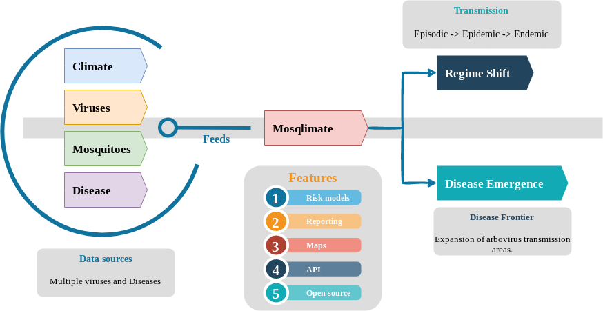

---
authors:
  - Elton Santana
date: 2023-07-14
hide:
  - navigation
  - toc
---

# Mosqlimate

For 40 years, Brazil has witnessed the emergence of diseases transmitted by the mosquito Aedes aegypti: DENV-1 (1986), DENV-2 (1991), DENV-3 (2001), DENV-4 (2010), Chikungunya (2014), and Zika (2015), with severe human and economic costs. Viruses at risk of emergence are Nhong-nhong, Mayaro, and Oropouche. Misdiagnosis is common, and emergence of new viruses can go largely unnoticed. New tools are needed to increase the precision of arbovirus surveillance and control in preparation for climate change. **Mosqlimate** is a multi-disease tool with two main goals: 

1. estimate probabilities of change in pattern of disease transmission in response to climate and land use changes; 
2. identify circulating viruses during outbreaks when information is incomplete. 

**Mosqlimate** will detect signs of expansion of arbovirus transmission areas, as well as signs of outbreaks potentially linked to new arboviruses. The tool will flexibly feed on climate and epidemiological data whenever available. **OviCounter** will fill in the mosquito data gap by providing digital technology to improve the use of eggtraps for mosquito surveillance at large scale. As output, **Mosqlimate** will deliver measures of risk to integrate into the Brazilian early warning system **Infodengue** and its mature community of practice. The ultimate goal of Mosqlimate is to improve the response to epidemiological challenges arising from climate change. Brazil is a continental country with a diversity of environmental and social conditions, all of them showing high vulnerability to the introduction of new viruses. But the frontier of expansion for these diseases do not respect country borders. Mosqlimate will seek to partner with similar initiatives in other countries, with particular emphasis on our South American neighbours.

  **Mosqlimate will feed on multiple data streams: Infodengue (incidence data), Climate forecasts and mosquito population density data (Ovicounter) and run multi-arboviruses risk assessment models.** Mosqlimate has two main endpoints: probability of regime shift, that is, change in pattern of disease transmission from sporadic to epidemic to endemic patterns in response to climate and land use changes; and an alarm model for arbovirus outbreaks by known or new viruses, that will detect signs of expansion of arbovirus transmission areas as well as signs of non-identified outbreaks potentially linked to new arboviruses.

{ width="850" }

---

# Team

::cards:: cols=4

- title: Flávio Codeço Coelho
  content: PI of the Mosqlimate and associate professor at the school of applied mathematics at FGV, Rio de Janeiro, Brazil. I am also part of the GRAPH network, based at the university of Geneva, where I am their data analysis coordinator. In Brazil, I am also one of the coordinators of the Infodengue project. My research interests revolve around the epidemiology of Infectious diseases from the point of view math, statistics and data-science.
  image: assets/img/team/flavio.png

- title: Thais Riback
  content: Biologist with a MSc and PhD in Zoology. I am interested in studies on ecology and population dynamics of arbovirus vectors and their impact on the dynamics of disease transmission. I currently work as an analyst at the Epidemiological Intelligence Center of the Secretariat of Health of Rio de Janeiro City and as a collaborating researcher in the Infodengue system.
  image: assets/img/team/thais.png

- title: Leo Bastos
  content: Public health researcher at Scientific Computing Program (PROCC), Oswaldo Cruz Foundation (Fiocruz). He is a research fellow at FAPERJ and CNPq. His main research is on developing and applying (Bayesian) statistical methods for infectious diseases epidemiology. He is a co-lead on WP2.
  image: assets/img/team/leo.png

- title: Luiz Max Carvalho
  content: Assistant Professor at the School of Applied Mathematics, Getulio Vargas Foundation. His interests are in Biostatistics, in particular Markov chain Monte Carlo, statistical phylogenetics and model combination. He's a co-lead on WP2, hoping to bring state-of-the-art model comparison and combination techniques to predict arboviral diseases.
  image: assets/img/team/luiz.png

- title: Sandro Loch
  content: a BIG DATA and AI student, with a focus on backend development and a commitment to collaborating on Open Source projects. My journey aims to combine technical expertise with meaningful contributions to projects that have a tangible impact on society. I work as a developer and maintainer of the Infodengue project, where I contribute to enhancing the visualization and analysis of data related to arboviruses.
  image: assets/img/team/sandro.png

- title: Iasmim Ferreira de Almeida
  content: Doctoral student in public health epidemiology at ENSP/FIOCRUZ and a specialist in microbiology. Researcher for the Infodengue project and here at Mosqlimate I am a researcher for the WP2 group, where I will work with models involving arbovirus regimes and their epidemiological and climatic factors. My research interests focus on communicable diseases and their epidemiology.
  image: assets/img/team/iasmim.png

- title: Raquel Martins Lana
  content: Beatriu de Pinós fellow at the Barcelona Supercomputing Center in the Global Health Resilience group. Her background is in quantitative epidemiology and her research focuses on infectious disease dynamics and their association with environmental, climate, and social factors. She works on WP2 in the Mosqlimate project.
  image: assets/img/team/raquel.png

- title: Luã Bida Vacaro
  content: Computer Science student and Open Source enthusiast. Software Developer & DevOps at Getulio Vargas Foundation, responsible for the development, deployment and maintenance of <a href="https://api.mosqlimate.org/">Mosqlimate's API</a> along with the WP2 group.
  image: assets/img/team/lua.png

- title: Leon Alves
  content: Professor at CEFET, Rio de Janeiro, Brazil. Developer of the Conta Ovos application, which aims to monitor the density of Aedes aegypti eggs in space and time. My interests are in image processing and application design.
  image: assets/img/team/leon.png

- title: Eduardo Correa Araujo
  content: A control and automation engineering student at UTFPR, Curitiba, Brazil. My interests are in working with differential equations and machine learning models to understand and predict the spread of infectious diseases. I work on WP2 in the models to understand the impact of climate factors on arboviruses spreading.
  image: assets/img/team/eduardo.png

- title: Marcio Maciel Bastos
  content: a Physics PhD candidate, holds a profound affinity for dynamic systems, statistical mechanics, Bayesian inference, and machine learning. Currently contributing his insights as a collaborative researcher to the Mosqlimate project.
  image: assets/img/team/marcio.png

::/cards::

--- 

 
 

### Contact

[Contact :material-email:](mailto:flavio.codeco.coelho@fgv.br){: .md-button} [{ align=right }](https://wellcome.org/news/new-digital-tools-use-climate-data-better-predict-and-prepare-infectious-diseases-outbreaks)

